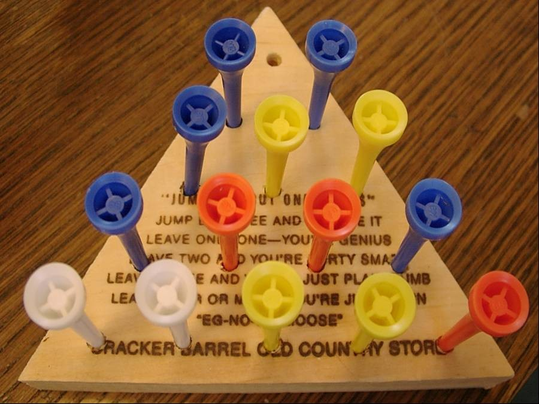
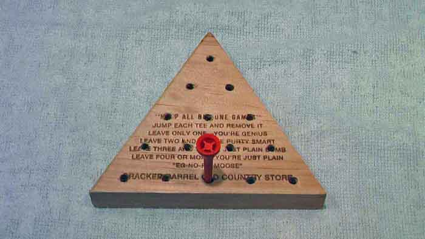

# Simple Cracker Barrel Game Solver

This is a simple JavaScript program to solve the Cracker Barrel game.

## Instructions for the Game

Basically you start with this:

and want to end with this:

by jumping tees and removing the tee that was jumped.

## The Solver

The solver script performs a simple brute force search using various starting holes.

There are several optimizations that could be applied to make the solver run faster (memoization) but it runs in under 10 seconds as is on my laptop.

## Results

It turns out that the best place to start (best first hole) is in the middle of an edge.
